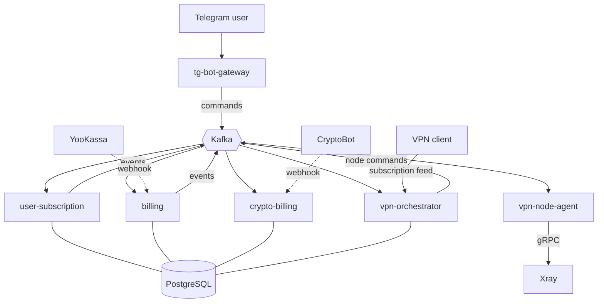

# House VPN Platform

[](https://github.com/WlcM111/vpn_system/actions/workflows/ci.yml)
[](https://go.dev/)
[](https://www.postgresql.org/)
[](https://kafka.apache.org/)

Event-driven VPN subscription platform: six Go microservices, Kafka messaging
with transactional outbox, PostgreSQL, and Telegram as the user interface.

**Running in production** with paying customers, recurring card payments,
cryptocurrency billing and automated VPN node orchestration.

---

## What it does

Users subscribe through a Telegram bot, pay by card or cryptocurrency, and get
a subscription link that their VPN client refreshes automatically. Access is
granted, renewed and revoked without manual intervention. VPN nodes register
themselves and are load-balanced by country.

## Architecture



### Services

| Service | Responsibility |
|---|---|
| `tg-bot-gateway` | Telegram UI. Holds no business logic — publishes commands, renders notifications |
| `user-subscription` | Source of truth for subscription state: trial, active, grace, expired |
| `billing` | Card payments via YooKassa: checkout, recurring charges, grace period, refunds |
| `crypto-billing` | Cryptocurrency payments via CryptoBot (USDT, TON, BTC, ETH) with live rates |
| `vpn-orchestrator` | Node pool, load balancing, credential issuance, subscription feed |
| `vpn-node-agent` | Runs on each VPN node, manages Xray users over gRPC, reports traffic |

### Delivery guarantees

Services never call each other directly — everything goes through Kafka.

**Transactional outbox.** Business data and the events it produces are written
in one transaction; a background worker publishes them afterwards. An event
can never describe a state that was not persisted.

**Idempotent consumers.** Every message is recorded in an inbox table inside
the transaction that applies its side effect, so redelivery is a no-op.

**Ordered per key.** Events sharing a message key are published in order; if
one fails, later events with that key wait rather than overtaking it.

**Dead letters.** After 20 failed attempts an event is moved aside for manual
inspection instead of blocking the queue.

The outbox implementation is published as a standalone library:
[**pgoutbox**](https://github.com/WlcM111/pgoutbox).

### VPN transport layer

Four transports are offered simultaneously, so blocking one does not cut the
user off:

| Transport | Purpose |
|---|---|
| VLESS over WebSocket | baseline |
| VLESS over XHTTP via CDN | survives direct-connection blocking |
| VLESS over gRPC | lower handshake latency |
| Hysteria2 (QUIC/UDP) | best for gaming and calls — no TCP-over-TCP head-of-line blocking |

Split routing rules are delivered with the subscription, so domestic traffic
bypasses the tunnel automatically.

## Tech stack

Go 1.25 · PostgreSQL 16 · Apache Kafka 3.9 (KRaft) · Redis 7 · Docker Compose ·
Prometheus · Grafana · Terraform · GitHub Actions · Xray-core · Hysteria2

## Project scale

| | |
|---|---|
| Go source | 17 000+ lines across 97 files |
| Services | 6 |
| Kafka topics | 16 including dead-letter topics |
| Database migrations | 33 |
| Prometheus metrics | 28 |

## Getting started

```bash
git clone https://github.com/WlcM111/vpn_system.git
cd vpn_system
cp deploy/.env.example .env    # fill in the secrets
docker compose --env-file .env -f deploy/docker-compose.dev.yml up -d --build
```

Grafana is available on `localhost:3000`, the subscription feed on
`localhost:8084/sub/{token}`.

## Testing

```bash
make test              # unit tests
make test-race         # with the race detector
make test-integration  # against a real PostgreSQL via testcontainers
make e2e               # full stack: webhook to subscription feed
make cover             # coverage report
```

Unit tests cover the allocator, rate conversion, retry scheduling and link
generation. Integration tests run against a real database and verify the
guarantees that only a database can provide: transactional atomicity,
`SKIP LOCKED` under concurrency, and inbox idempotency. The end-to-end suite
drives a payment webhook through the whole system and asserts the subscription
feed returns a working configuration.

## Infrastructure

`deploy/terraform/` provisions a VPN node on AWS: EC2 on ARM, Elastic IP,
security group, and an IAM role that reads secrets from SSM Parameter Store so
no credentials live in the repository. The node installs Docker and Xray on
first boot and registers itself with the orchestrator through heartbeat.

Cost analysis is in [`docs/aws-cost.md`](docs/aws-cost.md) — including why
production runs elsewhere.

## Observability

Prometheus scrapes every service; Grafana dashboards cover subscription
lifecycle, node health, payment flow and consumer lag. Health endpoints
(`/healthz`, `/readyz`) back the container health checks.

## License

Proprietary. The outbox implementation is available separately under MIT as
[pgoutbox](https://github.com/WlcM111/pgoutbox).