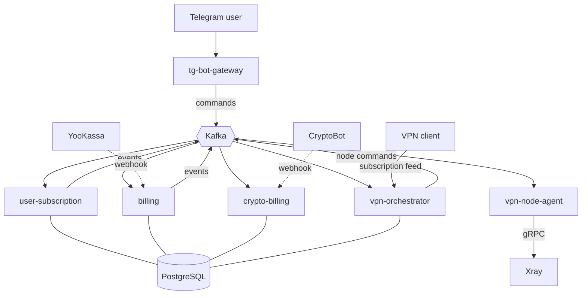

# House VPN Platform

[](https://github.com/WlcM111/vpn_system/actions/workflows/ci.yml)
[](https://go.dev/)
[](https://www.postgresql.org/)
[](https://kafka.apache.org/)

Event-driven VPN subscription platform: six Go microservices, Kafka messaging
with transactional outbox, PostgreSQL, and Telegram as the user interface.

**Running in production** with paying customers, automated subscription
lifecycle and self-registering VPN nodes.

---

## What it does

Users subscribe through a Telegram bot, pay by card, and get a subscription
link that their VPN client refreshes automatically. Access is granted, renewed
and revoked without manual intervention. VPN nodes register themselves and are
load-balanced by country.

## Architecture



### Services

| Service | Responsibility |
|---|---|
| `tg-bot-gateway` | Telegram UI. Holds no business logic — publishes commands, renders notifications |
| `user-subscription` | Source of truth for subscription state: trial, active, grace, expired |
| `billing` | Card payments via YooKassa: checkout, recurring charges, grace period, refunds |
| `crypto-billing` | Cryptocurrency payments via CryptoBot (USDT, TON, BTC, ETH). Implemented and deployed; the payment option is currently hidden in the bot UI |
| `vpn-orchestrator` | Node pool, load balancing, credential issuance, subscription feed |
| `vpn-node-agent` | Runs on each VPN node, manages Xray users over gRPC, reports traffic. Lives in a [separate repository](https://github.com/WlcM111/vpn_node_agent) |

### Delivery guarantees

Services never call each other directly — everything goes through Kafka.

**Transactional outbox.** Business data and the events it produces are written
in one transaction; a background worker publishes them afterwards. An event
can never describe a state that was not persisted.

**Idempotent consumers.** Every message is recorded in an inbox table inside
the transaction that applies its side effect, so redelivery is a no-op.

**Ordered per key.** Events sharing a message key are published in order; if
one fails, later events with that key wait rather than overtaking it.

**Dead letters.** After 20 failed attempts an event is moved aside for manual
inspection instead of blocking the queue.

The outbox implementation is published as a standalone library:
[**pgoutbox**](https://github.com/WlcM111/pgoutbox).

### Subscription lifecycle

Access is revoked independently of the payment provider. A sweep worker scans
for expired subscriptions and publishes a suspension event; the orchestrator
then removes the user's credentials from every node.

Auto-renewing subscriptions get a longer margin, because billing owns them
during its retry and grace window — the sweep acts as a safety net rather than
a competing mechanism.

### VPN transport layer

Four transports are offered simultaneously, so blocking one does not cut the
user off:

| Transport | Purpose |
|---|---|
| VLESS over WebSocket | baseline |
| VLESS over XHTTP via CDN | survives direct-connection blocking |
| VLESS over gRPC | lower handshake latency |
| Hysteria2 (QUIC/UDP) | best for gaming and calls — no TCP-over-TCP head-of-line blocking |

Split routing rules travel with the subscription, so domestic traffic bypasses
the tunnel automatically. Rules are compiled per client family: Xray-based
clients receive one format, Happ-based clients another.

## Tech stack

Go 1.26 · PostgreSQL 16 · Apache Kafka 3.9 (KRaft) · Redis 7 · Docker Compose ·
Prometheus · Grafana · Terraform · GitHub Actions · Xray-core · Hysteria2

## Project scale

| | |
|---|---|
| Go source | 17 000+ lines across 102 files |
| Test code | 2 400+ lines across 14 files |
| Services | 6 |
| Kafka topics | 16 including dead-letter topics |
| Database migrations | 33 |
| Prometheus metrics | 28 |

## Getting started

```bash
git clone https://github.com/WlcM111/vpn_system.git
cd vpn_system
cp deploy/.env.example .env    # fill in the values marked REQUIRED
docker compose --env-file .env -f deploy/docker-compose.dev.yml up -d --build
```

Grafana is available on `localhost:3000`, the subscription feed on
`localhost:8084/sub/{token}`.

## Testing

```bash
make test              # unit tests
make test-race         # with the race detector
make test-integration  # against a real PostgreSQL via testcontainers
make e2e               # full stack: payment webhook to subscription feed
make cover             # coverage report
```

**Unit tests** cover the pure logic: node allocation and load balancing,
currency conversion, retry scheduling, subscription link generation for all
four transports, routing rule compilation and the rate limiter.

**Integration tests** run against a real PostgreSQL started by
[testcontainers](https://golang.testcontainers.org/) and verify the guarantees
only a database can provide: transactional atomicity between business data and
outbox events, `FOR UPDATE SKIP LOCKED` under concurrent workers, and inbox
idempotency across redelivery.

**The end-to-end suite** brings up the full stack — Kafka, PostgreSQL, Redis
and three services — publishes a checkout command, delivers a payment webhook,
and asserts that the subscription feed ends up serving a working configuration.
The payment provider is replaced by a stub; everything else is real.

Coverage of the packages that carry logic:

| Package | Coverage |
|---|---|
| `internal/common/ratelimit` | 100.0% |
| `internal/vpn_orchestrator` | 17.4% |
| `internal/crypto_billing` | 7.0% |
| `internal/billing` | 1.8% |

The billing packages are dominated by database access and provider HTTP calls,
which integration tests cover better than unit tests; raising their numbers is
the next step rather than a finished one.

## Quality gates

Every push runs linting (`gofmt`, `go vet`, `golangci-lint` with `gosec`,
`errcheck`, `errorlint` and others), a build of all services, unit tests with
the race detector, integration tests against a real database, and a
vulnerability scan with `govulncheck`. A separate weekly workflow re-runs the
vulnerability scan so newly disclosed issues surface before they block a push.

## Architecture decisions

Non-obvious choices are recorded in [`docs/adr/`](docs/adr/) — the situation
that forced each decision, the options considered, and what it costs:

- [Transactional outbox instead of direct publishing](docs/adr/0001-transactional-outbox.md)
- [One agent per VPN node, not one per protocol](docs/adr/0002-single-agent-per-node.md)
- [Access revocation independent of the billing provider](docs/adr/0003-access-revocation-independent-of-billing.md)
- [AWS as an infrastructure-as-code demonstration, not production hosting](docs/adr/0004-aws-not-in-production.md)

## Infrastructure

`deploy/terraform/` provisions a VPN node on AWS: EC2 on ARM, Elastic IP,
security group, and an IAM role scoped to that node's parameters in SSM
Parameter Store, so no credentials live in the repository. IMDSv2 is enforced.
The node installs Docker and Xray on first boot and registers itself with the
orchestrator through heartbeat.

Cost analysis is in [`docs/aws-cost.md`](docs/aws-cost.md) — including why
production runs elsewhere.

## Observability

Prometheus scrapes every service; Grafana dashboards cover subscription
lifecycle, node health, payment flow and consumer lag. Health endpoints
(`/healthz`, `/readyz`) back the container health checks.

## License

Proprietary. The outbox implementation is available separately under MIT as
[pgoutbox](https://github.com/WlcM111/pgoutbox).